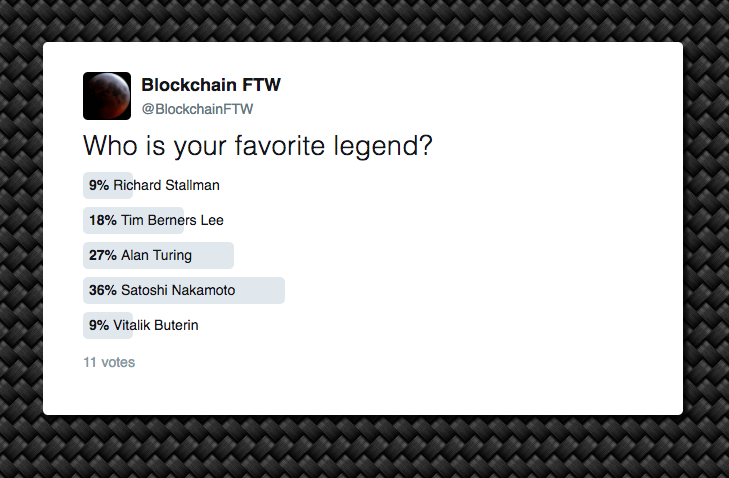

# ethereum-app-demo

> A simple app to demo what's possible with Ethereum.

This app mimics a simple Twitter poll with the votes being tracked on the Ethereum blockchain. It includes instructions for how to run it on a local blockchain, but can also be adapted to run on a testnet or the public Ethereum network.

## Prerequisites

Before you can install and run this app you must install Node/npm and install Truffle with `npm install -g truffle`. This demo has been tested with Node 12.10.0, npm 6.10.3 and Truffle 5.0.44.

## Installation

Clone this repository, then run `npm install`.

## Starting The App

Follow these steps to start the app;

1) Start a local Ethereum network: `npm run network`
2) In a new terminal tab, migrate your contract to the local network: `npm run migrate`
3) Start the app: `npm start`

## Configuration
To configure the poll options, edit `./candidates.json`. To edit the poll question, edit the paragraph in the render method of `./src/App.js`.

## Usage
Once the app is running, you can vote in a similar fashion to a poll on Twitter. You can open multiple windows and vote, and use the "Refresh" link at the bottom of the results list to refresh the results that are coming in from other windows. To vote again, reload the page to reset the poll UI. To clear the poll results, stop and restart the local Ethereum network.

## Notes

* By default, votes are stored on an in-memory blockchain. This means if you stop and restart the `npm run network` command you will lose any stored votes.
